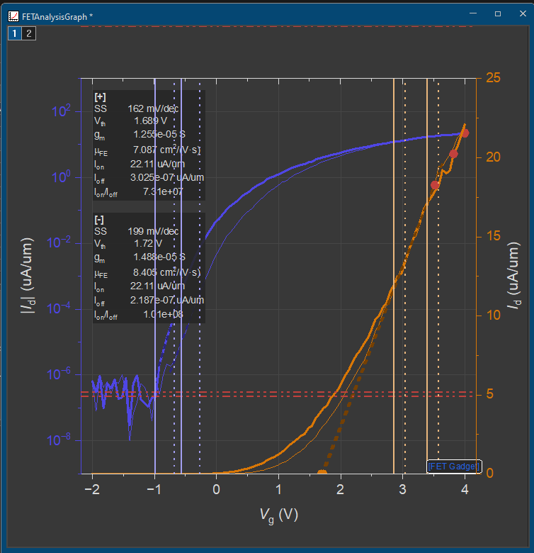

# FET Gadget for Origin

<p align="center">
  <a href="LICENSE"></a>
  <a href="#requirements"></a>
  <a href="../../releases"></a>
  <a href="docs/architecture.md"></a>
</p>

<p align="center"><b>English</b> | <a href="README.zh-CN.md">简体中文</a></p>

An interactive FET (field-effect transistor) transfer-curve analysis App for Origin/OriginPro.
Import raw CSVs, drag range cursors on the graph to bracket the fit windows, and extract SS, Vth,
gm, mobility, and Ion/Ioff with one click — forward and backward sweeps are detected and extracted
separately, and results from every curve you analyze accumulate in one results table.

The App's internal identity is **FET Gadget** (that's the name in `package.ini`, the OPX filename,
and the folder Origin installs it under); the repository folder is still named `FET Analyzer` from
an earlier iteration — both names refer to the same App.

<p align="center">
  
  <br>
  <sub>Dual-axis Id-Vg graph with draggable fit-window cursors and the forward (<code>[+]</code>) /
  backward (<code>[-]</code>) parameter summary drawn directly on the plot.</sub>
</p>

## Table of Contents

- [Features](#features)
- [Requirements](#requirements)
- [Installation](#installation)
  - [Option A — install a released OPX](#option-a--install-a-released-opx-recommended-for-users)
  - [Option B — build from source](#option-b--build-from-source-recommended-for-developers)
- [Usage](#usage)
- [Supported CSV formats](#supported-csv-formats)
- [Output](#output)
- [Project layout](#project-layout)
- [Development](#development)
- [Roadmap](#roadmap)
- [License](#license)

## Features

| | |
|---|---|
| **Flexible import** | Instrument multi-block `DataName/DataValue` CSVs, plain `Vg/Id` tables, or CSVs with explicit `Forward Vg/Forward Id/Backward Vg/Backward Id` columns. |
| **Automatic scan detection** | Forward (rising) and backward (falling) sweeps are detected and treated as paired curves automatically. |
| **Dual-axis graph** | Auto-generated Id-Vg graph: left axis is `\|Id\|` on a log scale, right axis is linear `Id`, both normalized to `uA/um` by channel width. |
| **Draggable fit windows** | Two pairs of free range cursors per direction — solid for forward, dash-dot for backward — mark the SS and Vth fit windows without snapping to data points. |
| **One-click extraction** | SS, Vth, max gm, field-effect mobility, Ion/Ioff, and hysteresis, with fit lines, reference lines, and a summary annotation drawn directly on the graph. |
| **Live Ioff** | Drag the Ioff reference line and Ioff / Ion-Ioff recompute immediately, on the graph and in the results table. |
| **Non-destructive scan mode** | Switching Auto/Forward/Backward/Both in Settings hides the unused direction's curve (not deletes it) and never discards the cursor positions you already tuned. |
| **Accumulating results** | One row per curve per direction in a hidden `Extracted Parameters` table — re-analyzing a curve updates its row in place, analyzing a different curve appends a new one. |
| **Compact multi-curve import** | Selecting more than one CSV file builds a single Vg/Id-only, multi-column (XYXY…) workbook instead of a graph — a light data table to run multi-curve analysis on next. A single file still imports in full (`Vg/Id/Ig/absId/Vd/logAbsId`) with its own graph, unchanged. |
| **Unified multi-curve analysis** | One command reads whichever worksheet or graph is already active (no file prompt), extracts SS/Vth/gm/mobility/Ion/Ioff from every curve, and builds the overlay graph and the parameter-distribution graph together. The overlay keeps the classic single-curve palette (indigo log axis, amber linear axis, both colored on the axes too) — every curve is genuinely translucent except the one with the best (lowest) SS, which stands out solid, bold, and fully opaque. No legend needed. Fitting settings live behind a `[FET Multi]` button right on either graph, with a `[Prev]`/`[Next]` pair to step through all 6 parameters. |
| **Scatter + marginal histograms** | Plot any two batch parameters (SS, Vth, gm, mobility, Ion, Ioff, Ion/Ioff, log₁₀ ratio) against each other with a histogram along each axis, aligned to the scatter's own range. Pick X/Y from two dropdowns. Tries Origin's native "Marginal Histograms" gallery template first, falls back to a hand-built equivalent graph automatically. |
| **Correlation matrix** | Pick which parameters to include with checkboxes; get a correlation **plot** — Origin's native "Scatter Matrix" gallery template — with a Pearson coefficient table as an automatic fallback if that can't be built. |
| **Progress while it runs** | Multi-file import and multi-curve batch fitting both show a native progress bar (with Cancel support) plus a status-bar text readout, instead of leaving you guessing. |

## Requirements

- **Origin or OriginPro 2018 or later** (`package.ini` declares a minimum of **9.5**, matching
  Origin 2018 — that's roughly when OriginLab's App Gallery/OPX packaging matured; the App can't
  install at all on versions that predate App Gallery support, regardless of this number). The
  code itself only uses long-standing Origin C / Apps APIs, but this floor hasn't been verified by
  actually running on Origin 2018 — please [open an issue](../../issues) if you hit a version-
  specific problem.
- Windows (the Origin C / OPX toolchain is Windows-only).
- To build from source, additionally:
  - Origin registered as a COM server on the machine (this happens automatically on a normal install).
  - PowerShell (the version 5.1 that ships with Windows is enough).

## Installation

### Option A — install a released OPX (recommended for users)

1. Download the latest `FET Gadget.opx` from [Releases](../../releases).
2. Drag the `.opx` file onto a running Origin window and follow the install prompt.
3. **FET Gadget** now appears in the App Gallery / Apps panel.

### Option B — build from source (recommended for developers)

```powershell
git clone https://github.com/GEMsLab-NUS/originlab-fet-gadget.git
cd originlab-fet-gadget
powershell.exe -NoProfile -ExecutionPolicy Bypass -File .\tools\build-opx.ps1
```

The build script:

1. Launches Origin (via COM) and compiles `origin-app/FET Analyzer/src/FETAnalyzer.c`.
2. Compiles and runs the runtime smoke test in `tests/FETAnalyzerSmoke.c` (skip with `-SkipSmoke`).
3. Syncs `origin-app/FET Analyzer` into `%LocalAppData%\OriginLab\Apps\FET Gadget` and packages it
   with `mkOPX` into `build/FET Gadget.opx`.

Since the build also installs/updates the App in your local Origin Apps directory, you can try it
in Origin immediately afterward without a separate drag-and-drop install. The resulting
`build/FET Gadget.opx` can still be copied to and installed on any other Origin machine (Option A).

<details>
<summary>Manual development install (debug directly in Code Builder, no OPX)</summary>

Copy `origin-app/FET Analyzer` to `%LocalAppData%\OriginLab\Apps\FET Gadget`, then add that folder
to your workspace in Origin's Code Builder to edit and debug in place. See
[docs/opx-packaging.md](docs/opx-packaging.md) for the full packaging/release walkthrough.

</details>

## Usage

Launching **FET Gadget** opens a dialog with buttons for **Import**, **Single-Curve Analysis**,
and **Multi-Curve Analysis**, plus a **More...** button for **Scatter + Histograms** and
**Correlation Matrix**.

### Demo videos

**Import & single-curve analysis**

https://github.com/user-attachments/assets/73d247df-0e6e-4a9b-8612-da2a005568a7

**Multi-curve analysis**

https://github.com/user-attachments/assets/25d83a72-da7c-4a33-8b2c-386c827eeda9

### Import

Pick one or more CSV files.

- **One file** — full import (`Vg/Id/Ig/absId/Vd/logAbsId`) plus the dual-axis Id-Vg graph, ready
  for single-curve analysis.
- **Multiple files** — a compact `Vg`/`Id`-only workbook (XYXY column pairs, no graph) — the entry
  point for multi-curve analysis.

### Single-curve analysis

1. Click the `Id` curve on the graph to select it, then run **Single-curve analysis** — it
   auto-places range cursors (two pairs if it detects a forward+backward sweep).
2. Drag the cursors to set the SS/Vth fit windows (solid = forward, dash-dot = backward) and drag
   the Ioff reference line to set the off-state level.
3. Run **Single-curve analysis** again to compute. Fit lines and a summary box (`[+]`/`[-]`) are
   drawn on the graph; results are appended to `FETGraphData → Extracted Parameters`.
4. Click the `FET Gadget` button on the graph for Device/Extraction/Cursors/Graph/Output settings
   (`L`/`W`/`Cox`/`Vd`, smoothing, fit-window sizes, min R², scan mode, colors). Switching scan
   mode never discards the other direction's cursors.

### Multi-curve analysis

Reads whichever worksheet or graph is **already active** — no file prompt.

1. Run **Multi-Curve Analysis** (or click `[FET Multi]` on a result graph) and set device/fit
   parameters, histogram bin count, and which parameter to open the stats graph on.
2. Every curve is fit automatically (progress bar + Cancel support), building:
   - **Overlay graph** (`FETMultiOverlayGraph`) — log `|Id|`/linear `Id`, all curves translucent
     except the lowest-SS one, which is solid and bold.
   - **Statistics graph** (`FETStatsGraph`) — one histogram at a time (SS, Vth, gm, µFE, Ion,
     log₁₀(Ion/Ioff)) with a normal-fit overlay; `[Prev]`/`[Next]` cycles through all six.
   - **Data** (`FETStatsData`) — `Parameters`, `Statistics`, `Histogram`, `OverlayCurves` sheets.

### Scatter + Histograms / Correlation Matrix

Both need `[FETStatsData]Parameters` to exist (run Multi-Curve Analysis first) and never re-fit
curves.

- **Scatter + Histograms** — pick X/Y parameters (SS, Vth, gm, Mobility, Ion, Ioff, Ion/Ioff, or
  log₁₀ ratio); builds `FETScatterGraph` (native "Marginal Histograms" template, hand-built
  fallback).
- **Correlation Matrix** — check 2+ parameters; builds `FETCorrelationGraph` (native "Scatter
  Matrix" template, Pearson-coefficient-table fallback at `[FETStatsData]Correlation`).

## Supported CSV formats

See [`origin-app/FET Analyzer/examples/`](origin-app/FET%20Analyzer/examples/) for sample files
covering each format:

| File | Format |
|---|---|
| `FET_transfer_sample.csv` | Plain two-column `Vg,Id` table. |
| `FET_transfer_double_scan.csv` | Single `Vg,Id` column, one continuous forward+backward sweep. |
| `FET_transfer_split_scan.csv` | Explicit `Forward Vg,Forward Id,Backward Vg,Backward Id` columns. |
| `FET_transfer_instrument_multicurve.csv` | Instrument export: metadata header + multiple `DataName/DataValue` blocks. |

## Output

| Location | Contents |
|---|---|
| Import workbook (e.g. `FETImportedData1`) | `Curves`: 6 columns per curve (`Vg`/`Id`/`Ig`/`absId`/`Vd`/`logAbsId`); `RawMeta`: skipped raw text lines, for troubleshooting import issues. |
| Id-Vg graph | Overlaid log `\|Id\|` (left) + linear `Id` (right) axes; forward is a solid line, backward is a thinner solid line; fit lines, reference lines, and the summary box are drawn on top. |
| Hidden workbook `FETGraphData` → `Curves` | Forward/backward split plus the full combined curve for whichever curve is currently being analyzed — feeds the graph's fit lines and hidden source plot; not normally something you need to open. |
| Hidden workbook `FETGraphData` → `Extracted Parameters` | **The main results table.** One row per curve per direction — SS, Vth, gm, mobility, Ion/Ioff, hysteresis, and every fit parameter, ready to export or post-process. |
| Multi-curve workbook (e.g. `FETMultiData1`) | `Curves`: 2 columns per curve (`Vg`/`Id` only, XYXY…) when more than one file was imported at once. No graph — run multi-curve analysis on this workbook next. |
| Graph `FETMultiOverlayGraph` | Log `\|Id\|` (left, indigo) + linear `Id` (right, amber) — the classic single-curve palette, colored axes included, no legend. Most curves are genuinely translucent; the lowest-SS curve is solid, bold, and fully opaque. Carries the `[FET Multi]` re-run button. |
| Workbook `FETStatsData` + graph `FETStatsGraph` | Multi-curve analysis output: `Parameters` (one row per analyzed curve), `Statistics` (N/mean/SD/median/min/max/CV per parameter), `Histogram` (bin data), `OverlayCurves` (derived data feeding the overlay graph), and a single-panel histogram graph with `[Prev]`/`[Next]` buttons to step through all six parameters. Rebuilt on every multi-curve analysis run. |
| Graph `FETScatterGraph` | Scatter of two chosen batch parameters plus marginal histograms on each axis (native Origin template when available, hand-built fallback otherwise), all aligned to the same range. Rebuilt on every Scatter + Histograms run. |
| Graph `FETCorrelationGraph` (or workbook `FETStatsData` → `Correlation` as a fallback) | Native Scatter Matrix plot over the parameters you checked, or — if that can't be confirmed — a Pearson correlation coefficient table. Rebuilt on every Correlation Matrix run. |

## Project layout

```text
origin-app/FET Analyzer/       App source and packaging assets (installs as "FET Gadget")
  src/FETAnalyzer.c              Core Origin C implementation (import, graphing, analysis)
  launch.ogs                     App entry point (LabTalk)
  package.ini                    App metadata (name, version, enable conditions, ...)
  xfunctions/                    Optional X-Function wrapper notes (fet_analyze)
  examples/                      Sample CSVs covering every supported input format
  templates/                     Placeholder notes for graph/analysis templates
tests/FETAnalyzerSmoke.c       Runtime smoke test (calls the real Origin C functions end-to-end)
tools/
  build-opx.ps1                  One-shot compile + smoke test + OPX packaging
  check-package.ps1              Static package-structure/metadata check (no Origin required)
docs/
  architecture.md                Runtime data flow, layer/column layout, implementation notes
  opx-packaging.md               Detailed OPX packaging and release steps
data/                            Real measurement samples used during development
```

## Development

```powershell
# Full build: compile + smoke test + package
powershell.exe -NoProfile -ExecutionPolicy Bypass -File .\tools\build-opx.ps1

# Skip the runtime smoke test, compile + package only (faster, less confidence)
powershell.exe -NoProfile -ExecutionPolicy Bypass -File .\tools\build-opx.ps1 -SkipSmoke

# Static package-structure check, no Origin required
powershell.exe -NoProfile -ExecutionPolicy Bypass -File .\tools\check-package.ps1
```

`tests/FETAnalyzerSmoke.c` drives the real exported Origin C functions (import, cursor placement,
computation, scan-mode switching, ...) and, when real measurement CSVs are found on the desktop,
additionally runs a pass against real data — checking curve counts, layer structure, the config
button, cursor read/write, and computed parameters. See [docs/architecture.md](docs/architecture.md)
for the full runtime data-flow notes.

## Roadmap

- Only linear extrapolation is implemented for Vth; constant-current and max-gm methods are not
  yet available.
- Multi-curve analysis always uses automatic SS/Vth window picking; per-curve manual cursor
  adjustment is only available in the single-curve flow.
- Multi-curve overlay translucency uses Origin's line-transparency format tag, which round-trips
  correctly on this build but isn't confirmed on every Origin version; it falls back to a plain
  opaque line automatically if a given install doesn't support it, rather than failing.
- Gate leakage (`Ig`) is imported but not yet used in analysis.
- Graph/analysis settings are session-local; they aren't yet persisted to the graph object or
  project file.
- Scatter + Histograms and Correlation Matrix both try Origin's native gallery templates
  (`plot_marginal`/`plotmatrix`) first and fall back automatically to a hand-built graph/table if
  a real result can't be confirmed. This fallback logic was verified thoroughly, but whether the
  native templates render correctly wasn't independently confirmed in a live interactive Origin
  session — if you only ever see the fallback (a hand-built 3-panel scatter+histogram graph, or a
  plain Pearson coefficient table instead of a Scatter Matrix plot), please
  [open an issue](../../issues) so the detection logic can be tuned further.
- The marginal histogram on the right side of the Scatter + Histograms fallback graph uses a
  horizontal bar plot type whose exact rendered orientation hasn't been independently visually
  confirmed (it compiles and produces a valid plot either way).

## License

[MIT](LICENSE)
